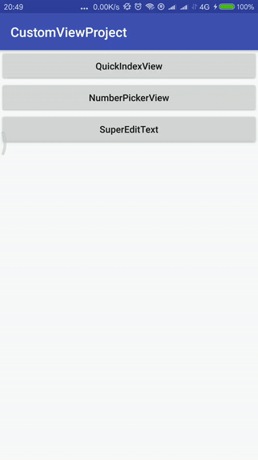

[](https://bintray.com/ayvytr/maven/custom-views/_latestVersion)  [](license)

<h1 id="AndroidCustomViews">AndroidCustomViews</h1>

方便安卓开发者使用的自定义控件库


## 加入Gradle依赖

	implementation 'com.ayvytr:custom-views:0.2.0'
	或者
	compile 'com.ayvytr:custom-views:0.2.0'


## 自定义控件列表

1. NumberPickerView 数字选择控件，支持多行和多种选项的数字选择控件 [使用方法](#NumberPickerView)

2. QuickIndexView 通讯录右侧字母索引控件 [使用方法](#QuickIndexView)

3. SuperEditText 可以一键清空，点击图标显示/隐藏密码的EditText  [使用方法](#SuperEditText)

4. SingleTextView 单行，居中，文本超出一行尾部省略的TextView 

5. ClearableEditText <font color=red>**0.2.0新加入**</font> 一键清空文本的EditText，直接继承AppCompatEditText  [使用方法](#ClearableEditText)

6. PasswordEditText <font color=red>**0.2.0新加入**</font> 点击或触摸显示/隐藏密码的EditText，直接继承AppCompatEditText [使用方法](#PasswordEditText)

    

___


## 截图

|                       NumberPickerView                       |                       NumberPickerView                       |                       NumberPickerView                       |
| :----------------------------------------------------------: | :----------------------------------------------------------: | :----------------------------------------------------------: |
|  |  |  |

| QuickIndexView                                               | SuperEditText                              | ClearableEditText                      |
| ------------------------------------------------------------ | ------------------------------------------ | -------------------------------------- |
|  |  |  |

| PasswordEditText                      |
| ------------------------------------- |
|  |


## 使用和说明

<h3 id="NumberPickerView">NumberPickerView</h3>

`NumberPickerView`是一款与android原生`NumberPicker`具有类似界面以及类似功能的`View`。
主要功能同样是从多个候选项中通过上下滚动的方式选择需要的选项，但是与`NumberPicker`相比较，有几个主要不同点，下面是两者的不同之处。

#### 原始控件特性-NumberPicker

1. 显示窗口只能显示3个备选选项；
2. 在fling时阻力较大，无法快速滑动；
3. 在选中与非选中状态切换比较生硬；
4. 批量改变选项中的内容时，没有动画效果；
5. 动态设置wrap模式时(`setWrapSelectorWheel()`方法)，会有“暂时显示不出部分选项”的问题；
6. 选中位置没有文字说明；
7. 代码中不能控制选项滑动滚动到某一item；

#### 自定义控件特性-NumberPickerView

1. 显示窗口可以显示多个备选选项；
2. fling时滑动速度较快，且可以设置摩擦力，如下代码使得摩擦力为默认状态的2倍<br>`mNumberPickerView.setFriction(2 * ViewConfiguration.get(mContext).getScrollFriction());`
3. 在选中与非选中的状态滑动时，具有渐变的动画效果，包括文字放大缩小以及颜色的渐变；
4. 在批量改变选项中的内容时，可以选择是否采用友好的滑动效果；
5. 可以动态的设置是否wrap，即，是否循环滚动；
6. 选中位置可以添加文字说明，可控制文字字体大小颜色等；
7. 具有在代码中动态的滑动到某一位置的功能；
8. 支持`wrap_content`，支持item的padding
9. 提供多种属性，优化UI效果
10. 在滑动过程中不响应`onValueChanged()`
11. 点击上下单元格，可以自动滑动到对应的点击对象。
12. 可通过属性设置`onValueChanged`等回调接口的执行线程。
13. 兼容NumberPicker的重要方法和接口


兼容的方法有：

```
setOnValueChangedListener()
setOnScrollListener()
setDisplayedValues()/getDisplayedValues()
setWrapSelectorWheel()/getWrapSelectorWheel()
setMinValue()/getMinValue()
setMaxValue()/getMaxValue()
setValue()/getValue()

兼容的内部接口有：
OnValueChangeListener
OnScrollListener

添加的接口有：
OnValueChangeListenerInScrolling//滑动过程中响应value change
```


#### NumberPickerView使用方法

1. 通过布局声明NumberPickerView

```xml
    <cn.carbswang.android.numberpickerview.library.NumberPickerView
        android:id="@+id/picker"
        android:layout_width="wrap_content"
        android:layout_height="240dp"
        android:layout_centerHorizontal="true"
        android:layout_marginTop="20dp"
        android:background="#11333333"
        android:contentDescription="test_number_picker_view"
        app:npv_ItemPaddingHorizontal="5dp"
        app:npv_ItemPaddingVertical="5dp"
        app:npv_ShowCount="5"
        app:npv_RespondChangeOnDetached="false"
        app:npv_TextSizeNormal="16sp"
        app:npv_TextSizeSelected="20sp"
        app:npv_WrapSelectorWheel="true"/>

```

3. Java代码中使用：
   1)若设置的数据(String[] mDisplayedValues)不会再次改变，可以使用如下方式进行设置：（与NumberPicker的设置方式一致）

```java
        picker.setMinValue(minValue);
        picker.setMaxValue(maxValue);
        picker.setValue(value);
```

  2)若设置的数据(String[] mDisplayedValues)会改变，可以使用如下组合方式进行设置：（与NumberPicker的更改数据方式一致）

```java
        int minValue = getMinValue();
        int oldMaxValue = getMaxValue();
        int oldSpan = oldMaxValue - minValue + 1;
        int newMaxValue = display.length - 1;
        int newSpan = newMaxValue - minValue + 1;
        if (newSpan > oldSpan) {
            setDisplayedValues(display);
            setMaxValue(newMaxValue);
        } else {
            setMaxValue(newMaxValue);
            setDisplayedValues(display);
        }
```

或者直接使用NumberPickerView提供的方法：<br>
    `refreshByNewDisplayedValues`(String[] display)<br>
使用此方法时需要注意保证数据改变前后的minValue值不变，以及设置的display不能够为null，且长度不能够为0。
  3)添加了滑动过程中响应value change的函数

```java
    picker.setOnValueChangeListenerInScrolling(...);
```

4.另外，NumberPickerView提供了平滑滚动的方法：<br>
    `public void smoothScrollToValue(int fromValue, int toValue, boolean needRespond)`<br>
    
此方法与`setValue(int)`方法相同之处是可以动态设置当前显示的item，不同之处在于此方法可以使`NumberPickerView`平滑的从滚动，即从`fromValue`值挑选最近路径滚动到`toValue`，第三个参数`needRespond`用来标识在滑动过程中是否响应`onValueChanged`回调函数。因为多个`NumberPickerView`在联动时，很可能不同的`NumberPickerView`的停止时间不同，如果在此时响应了`onValueChanged`回调，就可能再次联动，造成数据不准确，将`needRespond`置为`false`，可避免在滑动中响应回调函数。<br>

另外，在使用此方法或者间接调用此方法时，需要注意最好不要在`onCreate(Bundle savedInstanceState)`方法中调用，因为scroll动画需要一定时间，如需确要在`onCreate(Bundle savedInstanceState)`中调用，请使用如下方式：

```xml    
    @Override
    protected void onCreate(Bundle savedInstanceState) {
        super.onCreate(savedInstanceState);
        //代码省略
        mNumberPickerView.post(new Runnable() {
            @Override
            public void run() {
                //调用smoothScrollToValue()等方法的代码
            }
        });
    }
```

5.各项自定义属性的说明

```xml
    <declare-styleable name="NumberPickerView">
        <attr name="npv_ShowCount" format="reference|integer" />//显示的条目个数，默认3个
        <attr name="npv_ShowDivider" format="reference|boolean" />//是否显示两条divider，默认显示
        <attr name="npv_DividerColor" format="reference|color" />//两条divider的颜色
        <attr name="npv_DividerMarginLeft" format="reference|dimension" />//divider距左侧的距离
        <attr name="npv_DividerMarginRight" format="reference|dimension" />//divider距右侧的距离
        <attr name="npv_DividerHeight" format="reference|dimension" />//divider的高度
        <attr name="npv_TextColorNormal" format="reference|color" />//未选中文字的颜色
        <attr name="npv_TextColorSelected" format="reference|color" />//选中文字的颜色
        <attr name="npv_TextColorHint" format="reference|color" />//中间偏右侧说明文字的颜色
        <attr name="npv_TextSizeNormal" format="reference|dimension" />//未选中文字的大小
        <attr name="npv_TextSizeSelected" format="reference|dimension" />//选中文字的大小
        <attr name="npv_TextSizeHint" format="reference|dimension" />//说明文字的大小
        <attr name="npv_TextArray" format="reference" />//文字内容，stringarray类型
        <attr name="npv_MinValue" format="reference|integer" />//最小值，同setMinValue()
        <attr name="npv_MaxValue" format="reference|integer" />//最大值，同setMaxValue()
        <attr name="npv_WrapSelectorWheel" format="reference|boolean" />//设置是否wrap，同setWrapSelectorWheel
        <attr name="npv_HintText" format="reference|string" />//设置说明文字
        <attr name="npv_EmptyItemHint" format="reference|string" />//空行的显示文字，默认不显示任何文字。只在WrapSelectorWheel==false是起作用
        <attr name="npv_MarginStartOfHint" format="reference|dimension" />//说明文字距离左侧的距离，"左侧"是指文字array最宽item的右侧
        <attr name="npv_MarginEndOfHint" format="reference|dimension" />//说明文字距离右侧的距离
        <attr name="npv_ItemPaddingHorizontal" format="reference|dimension" />//item的水平padding，用于wrap_content模式
        <attr name="npv_ItemPaddingVertical" format="reference|dimension" />//item的竖直padding，用于wrap_content模式
        <attr name="npv_RespondChangeOnDetached" format="reference|boolean" />//在detach时如果NumberPickerView正好滑动，设置
        //是否响应onValueChange回调，用在一个Dialog/PopupWindow被显示多次，
        //且多次显示时记录上次滑动状态的情况。建议Dialog/PopupWindow在显示时每次都指定初始值，且将此属性置为false
        <attr name="npv_RespondChangeInMainThread" format="reference|boolean" />//指定`onValueChanged`响应事件在什么线程中执行。
        //默认为`true`，即在主线程中执行。如果设置为`false`则在子线程中执行。

        //以下属性用于在wrap_content模式下，改变内容array并且又不想让控件"跳动"，那么就可以设置所有改变的内容的最大宽度
        <!--just used to measure maxWidth for wrap_content without hint,
            the string array will never be displayed.
            you can set this attr if you want to keep the wraped numberpickerview
            width unchanged when alter the content list-->
        <attr name="npv_AlternativeTextArrayWithMeasureHint" format="reference" />//可能达到的最大宽度，包括说明文字在内，最大宽度只可能比此String的宽度更大
        <attr name="npv_AlternativeTextArrayWithoutMeasureHint" format="reference" />//可能达到的最大宽度，不包括说明文字在内，最大宽度只可能比此String的宽度+说明文字+说明文字marginstart +说明文字marginend 更大
        <!--the max length of hint content-->
        <attr name="npv_AlternativeHint" format="reference|string" />//说明文字的最大宽度
    </declare-styleable>

```


___


<h3 id="QuickIndexView">QuickIndexView</h3>

在布局文件中加入QuickIndexView，并且加入自定义属性，或者代码中动态创建和设置自定义属性即可

```
<com.ayvytr.customview.custom.index.QuickIndexView
    android:id="@+id/quickIndexView"
    android:layout_width="wrap_content"
    android:layout_height="wrap_content"
    android:layout_alignParentRight="true"
    android:background="#eee"
    android:gravity="center"
    android:lineSpacingExtra="@dimen/_10dp"
    app:indexArray="@array/defaultQuickIndexViewLetters"/>
```

	

#### API文档

```xml
clearIndexList()	清空字母索引.
getGravity()		获取当前 indexList Gravity
getIndexList()		获取 indexList
getLineSpacing()	获取字体上下间距值
getTextColor()		获取字体颜色 textColor
getTextSize()		获取字体大小
setGravity(int gravity)设置字母索引重心,只有 Gravity.TOP, Gravity.CENTER,Gravity.CENTER_VERTICAL有效，也就是说只有靠上对齐或者靠中间对齐有效.
setIndexArray(String[] letterArray)		设置 indexList
setIndexList(List<String> indexList)	设置 indexList
setLineSpacing(int lineSpacing)	设置字体上下间距值
setOnLetterChangeListener(OnLetterChangeListener onLetterChangeListener)	设置字母索引变化监听器
setTextColor(int textColor)	设置字体颜色 textColor
setTextSize(int textSize)	设置字体大小，如果字体大小和原来的相同，或者字体大小小于0，设置不生效.
```


#### 自定义属性表

```
android:textColor	字体颜色
android:textSize	字体大小
android:background	背景
android:gravity		字母索引重心（实际效果只有靠顶部对齐或者居中有效）
android:lineSpacingExtra	字母索引文字上下间距
indexArray			字母索引数组
```


<h3 id="SuperEditText">SuperEditText</h3>

#### API文档

```
addTextChangedListener(TextWatcher watcher)	添加文本变化监听器
getText()	获取当前文本
setClearIcon(Drawable drawable)	设置清除按钮图标
setClearIcon(int id)	设置清除按钮图标
setFocusChangeListener(View.OnFocusChangeListener l)	设置焦点变化监听器
setHint(int id)	设置提示文本
setHint(String hint)	设置提示文本
setKeyListener(KeyListener keyListener)	设置按键监听器
setSelection(int index)	设置光标位置
setText(int id)	设置文本
setText(String text)	设置文本
```


#### 自定义属性表

```
    <declare-styleable name="SuperEditText">
        <attr name="android:text"/>
        <attr name="android:hint"/>
        <attr name="android:inputType"/>
        <attr name="android:enabled"/>
        <attr name="android:background"/>
        <attr name="android:digits"/>
        <attr name="android:maxLength"/>
        <attr name="android:textColor"/>
        <attr name="android:textColorHint"/>
        <attr name="textPaddingLeft" format="dimension"/>
        <attr name="textPaddingRight" format="dimension"/>
        <attr name="textPaddingTop" format="dimension"/>
        <attr name="textPaddingBottom" format="dimension"/>
        <attr name="textPadding" format="dimension"/>
        <attr name="filterChinese" format="boolean"/>
        <attr name="switchShowPassword" format="boolean"/>
        <attr name="clearIcon" format="reference"/>
        <attr name="showClearIcon" format="boolean"/>
        <attr name="textBackground" format="reference"/>
    </declare-styleable>
```


<h3 id="ClearableEditText">ClearableEditText</h3>

#### API 文档

```java
getClearTextDrawable() 获取清除Drawable
isShowClearDrawableNoFocus() 没有焦点时是否显示清除Drawable
setClearTextDrawable(Drawable clearTextDrawable) 设置清除Drawable
setClearTextDrawable(int drawableId) 设置清除Drawable
setShowClearDrawableNoFocus(boolean showClearDrawableNoFocus) 设置没有焦点时是否显示清除Drawable
```

#### 自定义属性表

```
<declare-styleable name="ClearableEditText">
    <attr name="showClearDrawableNoFocus" format="boolean"/>	是否在没有焦点时显示Drawable
</declare-styleable>
```

<h3 id="PasswordEditText">PasswordEditText</h3>

#### API 文档

```
getHidePasswordDrawable() 获取隐藏密码Drawable
getShowPasswordDrawable() 获取显示密码Drawable
isPasswordInputType(int inputType) 判断输入类型是不是密码.
isShowDrawableNoFocus() 获取是否在没有焦点时显示Drawable.
setClickMode(boolean clickMode) 设置点击显示/隐藏Drawable模式
setHidePasswordDrawable(Drawable hidePasswordDrawable) 设置隐藏密码Drawable
setHidePasswordDrawable(int hidePasswordDrawableId) 设置隐藏密码Drawable
setShowDrawableNoFocus(boolean showDrawableNoFocus) 设置是否在没有焦点时显示Drawable
setShowPasswordDrawable(android.graphics.drawable.Drawable showPasswordDrawable) 设置显示密码Drawable
setShowPasswordDrawable(int showPasswordDrawableId) 设置显示密码Drawable
```


#### 自定义属性表

```
    <declare-styleable name="PasswordEditText">
        <attr name="showPasswordDrawable" format="reference"/>  显示密码Drawable
        <attr name="hidePasswordDrawable" format="reference"/>  隐藏密码Drawable
        <attr name="showDrawableWhenEmptyText" format="boolean"/> 当文本为空时是否显示Drawable
        <attr name="clickMode" format="boolean"/>   点击模式，true：点击显示，再次点击隐藏密码；false:按下显示，抬起隐藏密码
        <attr name="showDrawableNoFocus" format="boolean"/> 当没有焦点时是否显示Drawable
    </declare-styleable>
```


## ChangeLog

- 0.1.0

  - NumberPickerView 
  - QuickIndexView
  - SuperEditText
  - SingleTextView

- 0.2.0

  - ClearableEditText
  - PasswordEditText


## TODO

1. ~~SuperEditText自定义属性过多，需要优化和重新设计~~
2. 加入更多自定义View
3. 自定义TabLayout
4. 完善测试用例（欢迎熟练Espresso等测试的大神提意见或者推荐资料）


### 想要更多自定义控件请到[顶部](#AndroidCustomViews)提Issue或者Pull Request吧！


## 都看到这儿了，那就请点个[Star](#AndroidCustomViews)吧！非常感谢！